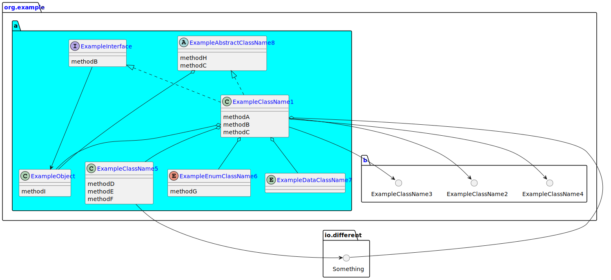

# class_relations

[](https://jitpack.io/#janphkre/class_relations)

Class_relations aims to provide a generator for class relations on a package level.

A simple example can be found in the tests:

[](library/src/test/resources/generator/basic_example_result.puml)

## Usage

Like any gradle plugin, class_relations is also defined as a plugin:

```groovy
pluginManagement {
    repositories {
        maven {
            url = uri("https://jitpack.io")
            content {
                includeGroupAndSubgroups("com.github")
            }
        }
    }
    resolutionStrategy {
        eachPlugin {
            requested.apply {
                if ("$id".startsWith("com.github.")) {
                    useModule("$id:gradle_plugin:$version")
                }
            }
        }
    }
}

plugins {
    id("com.github.janphkre.class_relations") version "$libs.versions.classRelationsPlugin"
}


pumlGenerate {
    destination = new File(project.buildDir, "generated/puml_class_relations")
    source = new File(project.projectDir, "src")
    projectPackagePrefix = "readme.example"
    selfColor = "#00FF00"
    spaceCount = 4
    generatedFileName = "class_relations.puml"
    filters = [
            "*",
            "**.*Module"
    ]
}
```

The task `generateClassRelationsPuml` can be executed to generate the diagrams.

### Multi module projects

If you want to use this plugin in a multi module project a different approach to the setup is needed in the root project.
Each submodule will then take on the configuration of the root project and use the detected package name of the sub project.
All sub projects will be linked against each other.
```groovy
pluginManagement {
    repositories {
        maven {
            url = uri("https://jitpack.io")
            content {
                includeGroupAndSubgroups("com.github")
            }
        }
    }
    resolutionStrategy {
        eachPlugin {
            requested.apply {
                if ("$id".startsWith("com.github.")) {
                    useModule("$id:gradle_plugin:$version")
                }
            }
        }
    }
}

plugins {
    id("com.github.janphkre.class_relations.grouping") version "$libs.versions.classRelationsPlugin"
}


pumlGenerate {
    destination = new File(project.buildDir, "generated/puml_class_relations")
    source = new File(project.projectDir, "src")
    projectPackagePrefix = "readme.example"
    selfColor = "#00FF00"
    spaceCount = 4
    generatedFileName = "class_relations.puml"
    filters = [
            "*",
            "**.*Module"
    ]
}
```

## License

This project is licensed under the Apache License 2.0, see [here](LICENSE).